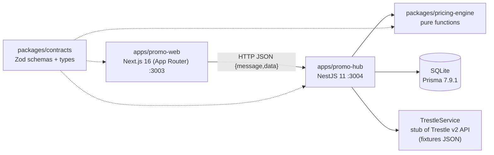

# Architecture

## Topology

One process per app, with no containers, queues, cache, jobs or object storage. Local development only. There is no deployment target.

## Workspace

| Package                                       | Role                                                                                               | May depend on                                |
| --------------------------------------------- | -------------------------------------------------------------------------------------------------- | -------------------------------------------- |
| `packages/contracts`                          | Zod schemas and inferred types for every API shape and domain model                                | `zod` only                                   |
| `packages/pricing-engine`                     | Quotes, bundle and stacking resolution, schedules and time, clash grid                             | `contracts`                                  |
| `packages/nest-common`                        | `ZodValidationPipe`, `ResponseEnvelopeInterceptor`, Swagger helpers (`ApiEndpoint`, `apiResponse`) | `contracts`, Nest                            |
| `packages/ui`                                 | shadcn components, theme tokens (`globals.css`)                                                    | React/Radix only                             |
| `packages/eslint-config`, `typescript-config` | Shared tooling config                                                                              | —                                            |
| `apps/promo-hub`                              | API, persistence, Trestle stub                                                                     | `contracts`, `pricing-engine`, `nest-common` |
| `apps/promo-web`                              | UI                                                                                                 | `contracts`, `ui`                            |

**Dependency direction:** apps → packages, never the reverse. `promo-web` never imports `pricing-engine` or `promo-hub`; all pricing goes through the API. Packages build to CJS `dist/`, except `ui`, which exports TSX source and is transpiled by Next.

## promo-hub modules

Every module follows `*.controller.ts` → `*.service.ts` → `*.client.ts`, with route strings in `src/paths/*.ts`.

| Module                                   | Owns                                                                | Data source                                                              |
| ---------------------------------------- | ------------------------------------------------------------------- | ------------------------------------------------------------------------ |
| `trestle` (global)                       | Stub of Trestle GET endpoints; `assumptions.ts`                     | `trestle/fixtures/trestle-fixtures.json` (copy of `../04_fixtures.json`) |
| `database` (global)                      | `PrismaService` and the adapter (`prisma-adapter.ts`)               | SQLite via `DATABASE_URL`                                                |
| `venues`, `products`, `members`, `staff` | Map Trestle's snake_case to contracts                               | Trestle stub                                                             |
| `rulebooks`                              | Legacy/live/draft, policy, publish/discard                          | Legacy: Trestle (derived per read). Live/draft: SQLite                   |
| `promotions`                             | CRUD on the **draft** only, and reference checks                    | via `RulebooksService`                                                   |
| `scenarios`                              | The brief's situations                                              | `scenarios/seed/scenarios.ts`                                            |
| `pricing`                                | Quote, impact (between two rulebooks), clash grid; calls the engine | other modules' services                                                  |
| `overrides`                              | Manual prices and their summary                                     | SQLite                                                                   |

Cross-module use goes through the **exported service**, never another module's client.

## Data ownership

| Data                                                 | Owner / store                  | Notes                                                                                                    |
| ---------------------------------------------------- | ------------------------------ | -------------------------------------------------------------------------------------------------------- |
| Venues, products, members, staff, Trestle promotions | Trestle (stub)                 | Read-only here; never copied into the database                                                           |
| Live and draft rulebooks with their promotions       | SQLite `Rulebook`, `Promotion` | JSON columns re-validated with `PromotionSchema` on every read. Publish replaces live in one transaction |
| Price overrides                                      | SQLite `PriceOverride`         | Belongs on the Trestle sale line in a real build                                                         |
| Scenarios, assumptions                               | Code                           | Static                                                                                                   |

Schema: `apps/promo-hub/prisma/schema.prisma`. Migrations: `prisma/migrations/`. Seed: `prisma/seed.ts`, which is idempotent. Moving to Postgres means changing the provider, the adapter file and `DATABASE_URL`.

## API

Swagger UI at `http://localhost:3004/docs`, generated from the Zod contracts through `ApiEndpoint`. Success body: `{ message, data }`. Errors come in two shapes:

- HTTP exceptions: `{ statusCode, message, error }`.
- Zod validation failures (400): a Zod error tree `{ errors, properties }`, from `ZodValidationPipe` in `nest-common`.

| Area       | Routes                                                                                                                                      |
| ---------- | ------------------------------------------------------------------------------------------------------------------------------------------- |
| Catalogue  | `GET /venues[/:venueId]`, `GET /products?venueId`, `GET /members/:memberNumber`, `GET /staff`                                               |
| Rulebooks  | `GET /rulebooks[/:name]`, `PATCH /rulebooks/draft/policy`, `POST /rulebooks/draft/{publish,discard}`                                        |
| Promotions | `GET /promotions[/:id]?rulebook=`, `POST/PATCH/DELETE /promotions[/:id]` (draft only)                                                       |
| Pricing    | `POST /pricing/quote` (`localDateTime` _or_ `at` instant), `GET /pricing/impact?from&to`, `GET /pricing/clash-grid?venueId&rulebook&weekOf` |
| Other      | `GET /scenarios`, `POST/GET /overrides`, `GET /overrides/summary`, `GET /health`                                                            |

## Time model

- Promotion windows are venue-local `[startsAt, endsAt)`. `24:00` is allowed as an end time. An end earlier than the start runs past midnight.
- `days` are **trading** days: before 05:00 counts as the previous day.
- A till instant (`at`) is converted with the venue's IANA timezone, which handles daylight saving.

All of this lives in `pricing-engine/src/time.ts` and `schedule.ts`.

## Security

- **No authentication or authorization.** Every endpoint is open, including publish. Run it on localhost only.
- The override permission check uses the `staffId` from the request body, so it can be spoofed. It demonstrates the rule, not real enforcement.
- CORS comes from `CORS_ORIGINS` in `apps/promo-hub/.env` (default `http://localhost:3003`).
- All request bodies and queries are validated with Zod (`ZodValidationPipe`).
- Env files: `apps/*/.env` are gitignored; `.env.example` files document the variables `PORT`, `CORS_ORIGINS`, `DATABASE_URL` and `NEXT_PUBLIC_PROMO_API_URL`. No secrets exist today. If some are added, keep them out of docs and examples.
- There are no tenants or organizations. Venues come from Trestle, and nothing in the prototype is scoped per organization.

## Technology status

| Component                                                                               | Status                                 |
| --------------------------------------------------------------------------------------- | -------------------------------------- |
| NestJS, Next.js App Router, Prisma + SQLite, Zod, React Query, shadcn/Radix, Tailwind 4 | Actively used                          |
| Swagger (`@nestjs/swagger`)                                                             | Used for docs only                     |
| `next-themes` dark mode                                                                 | Used                                   |
| Trestle payments, settlements, orders, sales, webhooks                                  | In the fixtures only; unused by design |
| Auth, tenants, queues, caching, jobs, logging beyond `console.log` at boot, CI, Docker  | Not present                            |
